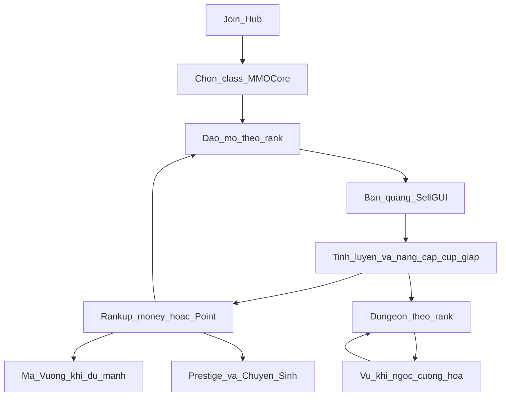

# Lối chơi Prison-RPG (journey + gap roadmap)

Tài liệu mô tả **trải nghiệm người chơi** từ lúc vào server tới endgame, dựa trên hệ thống đã có. Không thay thế plan kỹ thuật [`prison-rpg-plan.md`](prison-rpg-plan.md) — file đó là roadmap triển khai plugin/config; file này là nguồn “người chơi làm gì / vì sao”.

Cập nhật: 2026-07-29 (bổ sung lớp chống nhàm + đồng bộ docs).

Mục lục toàn bộ tài liệu server: [`INDEX.md`](INDEX.md).

---

## 1. Core fantasy & quyết định thiết kế

**Fantasy:** người chơi là tù nhân, leo thang 9 rank (Tân Binh → Vượt Ngục), đào kiếm tiền, chế đồ, đánh dungeon, rồi prestige / chuyển sinh.

**Hai trục tiến triển song song** (không gộp thành một thanh tiến độ):

| Trục | Việc chính | Mục tiêu |
| --- | --- | --- |
| **Sức đào** | Mỏ X-Prison → bán `/sellgui` → rankup → tinh luyện / lò rèn cúp | Mỏ cao hơn, thu nhập cao hơn, cuốc mạnh hơn |
| **Sức chiến** | Class MMOCore + vũ khí/giáp → dungeon MythicMobs → đục lỗ / ngọc / cường hóa → Ma Vương | Sống sót dungeon, farm nguyên liệu combat, boss endgame |

**Hai tiền tệ:**

| Tiền | Plugin | Dùng cho |
| --- | --- | --- |
| **Vault (tiền)** | EssentialsX Economy | Bán quặng, rankup bằng money, nhiều craft tốn tiền |
| **Point** | PlayerPoints (`vault: false`) | Rankup thay thế (`/xrankuppoint`), craft / trade đặc thù |

**Sell chuẩn người chơi:** `/sellgui` (EconomyShopGUI + sell-multiplier theo rank Prison và VIP). Module X-Prison `enchants` / `autosell` **không** nằm trong lối chơi hiện tại (giữ tắt trong design).

**PvP:** không thuộc soft-launch; hiện chỉ vài flag WorldGuard lẻ, chưa có mode PvP có chủ đích.

---

## 2. Vòng lặp chính

### Vòng ngắn (lặp mỗi session)

1. Vào mỏ đúng rank → đào quặng.
2. Craft block nén (nếu cần) → NPC **Tinh Luyện** → Đá Nâng Cấp / nguyên liệu.
3. NPC **Lò Rèn Cúp / Giáp** → nâng cấp trong rank (I→V).
4. `/sellgui` → lấy tiền → `/rankup` hoặc `/xrankuppoint` khi đủ **tiền/point + level MMOCore**.
5. Khi đủ đồ combat: vào dungeon cùng rank → farm vũ khí / nguyên liệu → đục lỗ / gắn ngọc / cường hóa → quay lại đào hoặc dungeon cao hơn.

### Gate rankup (đã có trong code)

File: [`plugins/Skript/scripts/prison/level_gate.sk`](../plugins/Skript/scripts/prison/level_gate.sk)

| Rank hiện tại | Rank kế | Level MMOCore tối thiểu |
| --- | --- | ---: |
| 1 Tân Binh | 2 Tù Nhân | 10 |
| 2 Tù Nhân | 3 Lao Công | 20 |
| 3 Lao Công | 4 Thợ Đào | 30 |
| 4 Thợ Đào | 5 Đội Trưởng | 45 |
| 5 Đội Trưởng | 6 Phó Quản Ngục | 60 |
| 6 Phó Quản Ngục | 7 Quản Ngục | 75 |
| 7 Quản Ngục | 8 Bá Chủ Ngục Tù | 90 |
| 8 Bá Chủ | 9 Vượt Ngục | 100 |

Rankup money: `/rankup` hoặc `/xrankup`. Rankup point: `/xrankuppoint`. Menu: `/rank` → DeluxeMenus `ranks_master`.

---

## 3. Giai đoạn trải nghiệm

### 3.1 Onboarding (hub `world`) — mục tiêu thiết kế

1. Vào spawn / hub (`world`) — không đào được ở đây.
2. Chọn class MMOCore.
3. Nhận cuốc **Tân Binh I** (kit prison, không phải Essentials `tools` vanilla).
4. Warp sang `world_prison` mỏ Tân Binh.
5. Đào → bán lần đầu (`/sellgui`) → gặp NPC Tinh Luyện / Lò Rèn.

**Trạng thái:** đã test onboard khi làm — coi P0.1 xong; không ưu tiên làm lại trừ khi phát hiện lỗ hổng join mới.

### 3.2 Early — Rank 1–3 (Tân Binh → Lao Công)

- **Mỏ:** cobble → coal → copper (cascade ore theo rank).
- **Craft:** chế Đá Nâng Cấp → nâng cúp I→V trong cùng rank tại NPC forge.
- **Combat:** dungeon `world_dungeon` cùng rank (Normal / Elite / Boss) lấy vũ khí và nguyên liệu sơ khởi.
- **Mục tiêu cảm giác:** hiểu vòng đào–bán–nâng–rankup trong ~1–2 giờ đầu.

### 3.3 Mid — Rank 4–6 (Thợ Đào → Phó Quản Ngục)

- Ore đắt hơn + sell-multiplier tăng ([`DOCS_HE_THONG_PRISON.md`](../DOCS_HE_THONG_PRISON.md): +15% → +30%).
- Lò rèn **giáp** + vũ khí theo rank (Kiếm / Rìu / Trượng — chọn theo class).
- Mở lớp build: **Đục lỗ** (`/duclo`) → gắn **Ngọc** → **Cường hóa** (`/cuonghoa`).
- Jewelry / Long Tộc / crates là lớp phụ — không bắt buộc để leo rank.

### 3.4 Late — Rank 7–9 (Quản Ngục → Vượt Ngục)

- Dungeon cao; rank 6–9 hướng `world_magadungeon` (theo spawner docs).
- Farm **Mảnh Huy Hiệu Triệu Hồi** từ boss rank → NPC chế **Huy Hiệu Triệu Hồi** → bàn thờ **Ma Vương**.
- Tham chiếu: [`npc-huy-hieu-trieu-hoi-notes.md`](npc-huy-hieu-trieu-hoi-notes.md), Skript `plugins/Skript/scripts/demon_king/`.

### 3.5 Endgame — hai meta tách bạch

| Hệ | Điều kiện (tóm tắt) | Reset gì | Giữ / nhận gì | Vai trò lối chơi |
| --- | --- | --- | --- | --- |
| **Prestige (X-Prison)** | Đạt rank 9 + đủ tiền prestige | Reset rank về đầu (`reset_rank_after_prestige: true`) | Giữ số prestige | Vòng grind **mining** dài hạn |
| **Chuyển Sinh (`/chuyensinh`)** | Rank 9 + MMOCore lv100 + $100,000,000 | Theo logic Skript rebirth (không phải reset rank X-Prison) | Điểm skill cây chuyển sinh, bonus EXP | Meta **RPG** dài hạn |

Config tham chiếu:

- Prestige: [`plugins/X-Prison/prestiges.yml`](../plugins/X-Prison/prestiges.yml)
- Chuyển Sinh: [`plugins/Skript/scripts/rebirth/config.sk`](../plugins/Skript/scripts/rebirth/config.sk)

**X-Prison Rebirths module** (`rebirths.yml`): **không** đưa vào lối chơi người chơi — tránh nhầm với `/chuyensinh`. Khi triển khai: ẩn lệnh/UI hoặc tắt module.

**VIP donor:** multiplier bán chồng sau rank 9 (VIP → LEGEND, tới x3.0). Không thay progression free; chỉ tăng tốc earn.

---

## 4. Vai trò từng hệ (người chơi nhìn thấy gì)

| Hệ | Việc người chơi làm | File / khu vực chính |
| --- | --- | --- |
| X-Prison mines / ranks | Đào đúng mỏ rank; leo thang 9 rank | `plugins/X-Prison/`, WG regions `world_prison` |
| EconomyShopGUI | Bán quặng, thấy multiplier | `plugins/EconomyShopGUI/`, docs multipliers |
| MMOItems stations + NPC | Tinh luyện, nâng cúp/giáp theo rank | `crafting-stations/refinery-*.yml`, `forge-*.yml`, `armor-forge-*.yml`, Citizens |
| MMOCore | Class, level, skill; gate rankup | `plugins/MMOCore/classes/`, `level_gate.sk` |
| MythicMobs dungeon | Farm combat / boss theo rank | `mobs/prison_rank_mobs.yml`, `docs/SPAWNER_LIST.md` |
| Đục lỗ / Ngọc / Cường hóa | Build chỉ số combat | `scripts/sockets/`, `scripts/upgrade/`, `item/gem_stone.yml` |
| Ma Vương | Boss endgame theo chu kỳ | `scripts/demon_king/`, `huy-hieu-trieu-hoi.yml`, hologram `MaVuongTimer` |
| Prestige / Chuyển Sinh | Hai meta dài hạn tách bạch | `prestiges.yml`, `scripts/rebirth/` |
| Jewelry / Long Tộc / crates | Bonus / cosmetic / sink phụ | `item/ring.yml`…, trade/donate stations, ExcellentCrates |

Quy chuẩn chỉ số combat (không phải journey): [`STAT_BALANCING_STANDARD.md`](../STAT_BALANCING_STANDARD.md), [`STAT_ABBREVIATIONS.md`](STAT_ABBREVIATIONS.md).

---

## 5. Thang 9 rank (nhanh)

| # | Rank | Mỏ / ID kỹ thuật thường gặp |
| ---: | --- | --- |
| 1 | Tân Binh | cobblestone |
| 2 | Tù Nhân | coal |
| 3 | Lao Công | copper |
| 4 | Thợ Đào | iron |
| 5 | Đội Trưởng | gold |
| 6 | Phó Quản Ngục | redstone |
| 7 | Quản Ngục | lapis |
| 8 | Bá Chủ Ngục Tù | diamond |
| 9 | Vượt Ngục | emerald |

LuckPerms groups bán: `xprison_rank_1` … `xprison_rank_9` (+ VIP stacks sau đó).

---

## 6. Lớp chống nhàm chán (engagement)

Core loop đào–bán–rankup dễ nhàm nếu chỉ có một việc lặp. Lớp dưới **không thay core**, mà tạo lý do đăng nhập ngắn / mục tiêu tuần / sự kiện xã hội. Ưu tiên **tận dụng asset đã có** trước khi viết hệ mới.

### 6.1 Nguyên tắc

1. Mỗi ngày có **ít nhất 1 mục tiêu 10–20 phút** (daily), không bắt AFK cả buổi.
2. Mỗi tuần có **1 sự kiện giờ cố định** để người chơi rủ nhau online.
3. Phần thưởng ưu tiên **sink + tiến triển** (key, đá cường hóa, Point, mảnh boss) — hạn chế dump tiền Vault thô gây lạm phát.
4. Không thêm hệ reset thứ 3 (không bật X-Prison Rebirths cho player).

### 6.2 Tính năng đã chốt (design)

| # | Tính năng | Player cảm nhận | Nguồn / triển khai | Ưu tiên |
| ---: | --- | --- | --- | --- |
| A | **Nhiệm vụ Ngày / Tuần** | Login → làm 2–3 quest (đào / giết / bán) → nhận thưởng | Plugin **BattlePass** đã cài; quest mix mining + dungeon + sell | P1 |
| B | **Chợ Đen** | Đăng bán / săn deal hết hạn 24h — FOMO + kinh tế player | Skript `black_market/` đã viết, **chưa** trong `00_system_loader.sk` → bật loader | P1 |
| C | **Đêm Nguyệt Huyết** | Cuối tuần 2 giờ: mob vampire mạnh hơn, drop tốt hơn | Mob sẵn: `bloodmoon_vampire_mobs.yml` + schedule/announce (Skript hoặc MM) | P1 |
| D | **Lịch Ma Vương cố định** | Biết giờ boss → chủ động farm huy hiệu / online đúng cửa sổ | Hologram `MaVuongTimer` + announce; polish sink `TINHTHE_HUY_DIET` | P1 |
| E | **Mốc đào (Block milestones)** | 10k / 50k / 100k… blocks → rương thưởng (không phải chỉ số ảo) | X-Prison `/blocks` + Skript reward hoặc BattlePass milestone | P2 |
| F | **BXH tuần** | Đua blocks mined / boss kill / prestige — khoe tab & thưởng top | PlaceholderAPI + DecentHolograms / TAB; reset weekly | P2 |
| G | **Đêm Vượt Ngục** (themed night) | 1 tối/tuần: +sell mult tạm + dungeon loot boost 2 giờ | Skript multiplier tạm + announce; khớp fantasy “vượt ngục” | P2 |
| H | **Chìa khóa tuần từ daily** | Làm daily cả tuần → 1 key crate Long Tộc | ExcellentCrates + BattlePass weekly reward (đã có hệ Long Tộc) | P2 |

### 6.3 Lịch gợi ý tuần (sau khi P0 xong)

| Ngày | Nội dung |
| --- | --- |
| Mỗi ngày | Daily quest (A) + Chợ Đen luôn mở (B) |
| Thứ 4 | Nhắc Ma Vương / cửa sổ triệu hồi (D) |
| Thứ 7 tối | Đêm Nguyệt Huyết 2 giờ (C) |
| Chủ nhật tối | Đêm Vượt Ngục 2 giờ (G) — hoặc xen kẽ tuần chẵn/lẻ với C |
| Cuối tuần | Snapshot BXH tuần (F) + trao thưởng |

### 6.4 Cố ý không thêm (tránh phình scope)

- Nuke/Layer X-Prison làm “đào một phát hết mỏ” — phá nhịp + lệch design (enchants tắt).
- PvP arena trước khi dungeon/spawner ổn.
- Season pass phức tạp tách khỏi BattlePass (dùng 1 hệ quest đủ).

---

## 7. Roadmap gap (ưu tiên soft-launch)

Ưu tiên theo “phá được soft-launch playable loop”, rồi mới engagement / gắn RPG.

### P0 — Vòng chơi gãy nếu thiếu

| # | Việc | Vì sao | File / hành động |
| ---: | --- | --- | --- |
| 1 | **Onboarding hub** | ~~Join chưa dạy vòng Prison~~ | **Đã test khi làm** — bỏ khỏi hàng đợi trừ khi join mới bị lệch |
| 2 | **Đặt spawner dungeon rank 2–9** | ~~Combat chết sau rank 1~~ | **Đã xong** (theo admin) — nếu YAML còn `# TODO` thì rà lại lưu spawner |
| 3 | **PAPI expansions** | ~~Menu `/rank` placeholder thô~~ | **Đã xong** (theo admin) — mở `/rank` xác nhận không còn `%...%` |
| 4 | **Một đường nâng cúp** | ~~NPC + Skript chồng UX~~ | **Đã xong** — chuẩn = NPC `forge-*` |

### P1 — Chạy được nhưng mơ hồ / lệch + engagement nền

| # | Việc | Vì sao | File / hành động |
| ---: | --- | --- | --- |
| 5 | **Làm rõ Prestige vs Chuyển Sinh** | Dễ nhầm với X-Prison Rebirths | UI/hologram/help; tắt hoặc ẩn module rebirths X-Prison khỏi người chơi |
| 6 | **Cân bằng kinh tế Phase 6** | Ore cascade 30/70 rất “béo” vs giá rankup / forge | Giá sell EconomyShopGUI, cost rank, recipe forge |
| 7 | **Ma Vương polish + lịch cố định** | Altar có sẵn; cần sink drop + giờ chơi rõ (§6.2 D) | `demon_king/`, droptables, `MaVuongTimer.yml`, announce |
| 8 | **Đồng bộ docs ops** | Docs từng nói X-Prison enchants bật | Đã chuẩn hóa trong [`DOCS_HE_THONG_PRISON.md`](../DOCS_HE_THONG_PRISON.md) + [`INDEX.md`](INDEX.md) — giữ khớp khi đổi config |
| 9 | **Daily/Weekly quests (BattlePass)** | Lý do login ngắn mỗi ngày (§6.2 A) | Cấu hình BattlePass quest mine/kill/sell |
| 10 | **Bật Chợ Đen** | Kinh tế player + FOMO (§6.2 B) | Thêm `sk reload black_market/` vào [`00_system_loader.sk`](../plugins/Skript/scripts/00_system_loader.sk); test GUI |
| 11 | **Đêm Nguyệt Huyết** | Sự kiện cuối tuần (§6.2 C) | Schedule spawn `bloodmoon_vampire_mobs` + drop table + announce |

### P2 — Gắn RPG chặt hơn + engagement sâu

| # | Việc | Ghi chú |
| ---: | --- | --- |
| 12 | Profession Mining gắn ore/region prison | Level gate đã đủ soft-launch |
| 13 | Auto grant cuốc/kit theo rank | Thay `/mi give` thủ công |
| 14 | Mốc đào + BXH tuần + Đêm Vượt Ngục + key tuần | §6.2 E–H |
| 15 | Crates Long Tộc gắn daily/weekly | ExcellentCrates + BattlePass |
| 16 | PvP có chủ đích (arena/duel) | Sau khi PvE + event ổn |

### Không nằm trong lối chơi soft-launch

- Bật X-Prison Nuke/Layer/Enchant làm core loop.
- Viết lại toàn bộ stat theo balancing standard (chỉ tham chiếu).
- Ba hệ reset chồng nhau (Prestige + Chuyển Sinh + X-Prison Rebirths cùng hiện cho player).

---

## 8. Worlds & inventory

| World | Vai trò |
| --- | --- |
| `world` | Hub / spawn — không đào |
| `world_prison` | 9 mỏ theo rank |
| `world_dungeon` | Dungeon combat early–mid |
| `world_magadungeon` | Dungeon cao (rank muộn) |

Multiverse-Inventories group `default` share inventory/stats giữa các world trên (một nhân vật xuyên hub–mỏ–dungeon).

---

## 9. Ghi chú lệch docs / config (ops)

| Chủ đề | Docs / kỳ vọng cũ | Thực tế design hiện tại |
| --- | --- | --- |
| Plugin prison | Plan cũ nhắc PrisonMC / `plugins/Prison/` | **X-Prison** là stack sống; folder Prison cũ không phải lối chơi |
| Sell / enchant | Docs cũ nói X-Prison autosell + Nuke/Layer | Bán = EconomyShopGUI; X-Prison `enchants`/`autosell` = **false** |
| Nâng cúp | Có thể còn mention Skript nâng cúp | Chuẩn người chơi = **NPC crafting station** |
| Endgame reset | Dễ lẫn prestige / rebirth / chuyển sinh | Player-facing chỉ **Prestige** + **Chuyển Sinh** |
| Engagement | Core loop đơn điệu | Xem §6 — BattlePass / Chợ Đen / Nguyệt Huyết / lịch boss |

---

## 10. Checklist kiểm chứng

- [ ] Người mới đọc §2–§3 kể lại được: giờ đầu / mid / endgame làm gì.
- [x] P0.1 Onboarding — đã test khi làm.
- [x] P0.2 Spawner rank 2–9 — đã xong (theo admin).
- [x] P0.3 PAPI — đã xong (theo admin).
- [x] P0.4 Một đường nâng cúp — đã xong.
- [ ] Một tài khoản test đi được vòng full: đào → bán → nâng cúp NPC → rankup → dungeon rank 2+.
- [ ] Menu `/rank` không còn placeholder thô `%...%` (xác nhận nhanh).
- [x] Không có UI/lệnh X-Prison Rebirths cạnh `/chuyensinh` gây nhầm.
- [ ] Sau P1: daily quest + Chợ Đen + ít nhất 1 sự kiện tuần chạy được trên server test.
